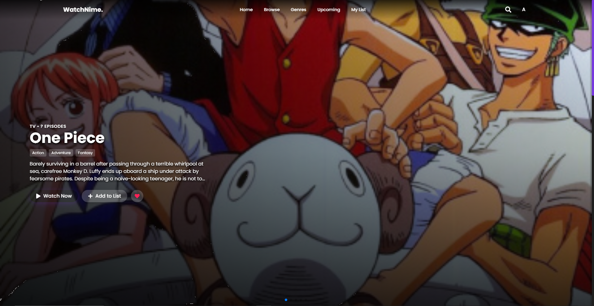
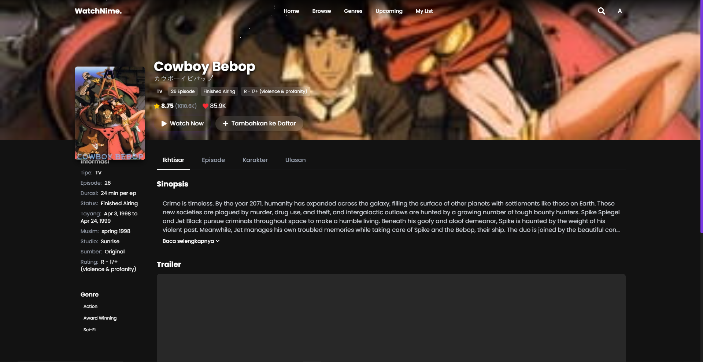

# WatchNime 🍥

<div align="center">
  
  <p><em>Platform streaming anime terbaik untuk para penggemar anime di Indonesia</em></p>
</div>

<div align="center">

<!--  -->


</div>

## ✨ Fitur Utama

- 🌟 **UI Modern & Responsif** - Tampilan yang menarik dan mudah digunakan di semua perangkat
- 🎬 **Streaming Anime** - Tonton episode terbaru dari anime favorit Anda
- 🔍 **Pencarian Canggih** - Temukan anime dengan cepat berdasarkan judul, genre, musim, dan lainnya
- 📱 **Desain Mobile-First** - Pengalaman pengguna yang optimal di perangkat mobile
- 🎭 **Detail Lengkap** - Informasi lengkap untuk setiap anime, termasuk sinopsis, genre, dan karakter
- 📊 **Top Anime & Karakter** - Lihat anime dan karakter yang paling populer
- 🗓️ **Anime Musiman** - Jelajahi anime berdasarkan musim dan tahun
- 📑 **MyList** - Simpan anime favorit Anda dalam daftar pribadi

## 🚀 Demo

Kunjungi demo aplikasi di: [https://watchnime.vercel.app](https://watchnime.vercel.app)

## 📷 Screenshots

<div align="center">
  
  
</div>

## 🛠️ Teknologi

WatchNime dibangun dengan teknologi modern untuk memberikan pengalaman terbaik:

- **React** - Pustaka JavaScript untuk membangun antarmuka pengguna
- **Tailwind CSS** - Framework CSS untuk desain cepat dan responsif
- **Jikan API** - Integrasi dengan API MyAnimeList tidak resmi untuk data anime
- **React Router** - Navigasi antar halaman yang mulus
- **React Icons** - Koleksi ikon populer untuk tampilan yang cantik

## 📋 Prasyarat

Sebelum Anda mulai, pastikan Anda telah menginstal:

- Node.js (versi 14.x atau lebih tinggi)
- npm atau yarn

## 🔧 Instalasi

Ikuti langkah-langkah ini untuk menjalankan proyek secara lokal:

```bash
# Clone repositori
git clone https://github.com/FANNYMU/watchnime.git

# Pindah ke direktori proyek
cd watchnime

# Instal dependensi
npm install
# atau
yarn install

# Jalankan server pengembangan
npm run dev
# atau
yarn dev
```

Buka [http://localhost:5173](http://localhost:5173) di browser Anda untuk melihat aplikasi.

## 🧩 Struktur Proyek

```
watchnime/
├── public/              # Aset statis
│   ├── api/             # Data JSON lokal untuk fallback
│   └── images/          # Gambar dan aset media
├── src/                 # Kode sumber aplikasi
│   ├── components/      # Komponen React yang dapat digunakan kembali
│   ├── pages/           # Halaman aplikasi
│   ├── services/        # Layanan dan API
│   └── styles/          # File CSS dan Tailwind
└── README.md            # Dokumentasi proyek
```

## 📱 Dukungan Mobile

WatchNime dioptimalkan untuk pengalaman mobile dengan pendekatan desain mobile-first:

- Layout responsif yang beradaptasi dengan ukuran layar
- Kontrol sentuh yang mudah digunakan
- Navigasi yang ramah mobile
- Pengoptimalan performa untuk perangkat dengan sumber daya terbatas

## 🌐 API dan Penanganan Data

Aplikasi ini menggunakan Jikan API untuk mendapatkan data anime dan karakter. Sebagai fallback saat API tidak tersedia atau mencapai batas rate, aplikasi akan menggunakan data JSON lokal yang disimpan dalam folder `public/api/`.

## 🤝 Kontribusi

Kontribusi selalu diterima! Jika Anda ingin berkontribusi:

1. Fork repositori
2. Buat branch fitur baru (`git checkout -b feature/AmazingFeature`)
3. Commit perubahan Anda (`git commit -m 'Add some AmazingFeature'`)
4. Push ke branch (`git push origin feature/AmazingFeature`)
5. Buka Pull Request

## 📄 Lisensi

Proyek ini dilisensikan di bawah [MIT License](LICENSE).

## 📞 Kontak

Untuk pertanyaan atau komentar, hubungi kami di:

- Email: contact@watchnime.com
- Twitter: [@watchnime](https://twitter.com/watchnime)
- GitHub: [https://github.com/FANNYMU/watchnime](https://github.com/FANNYMU/watchnime)

---

<div align="center">
  <p>Dibuat dengan ❤️ oleh Tim WatchNime</p>
  <p>© 2023 WatchNime. Semua hak dilindungi.</p>
</div>
